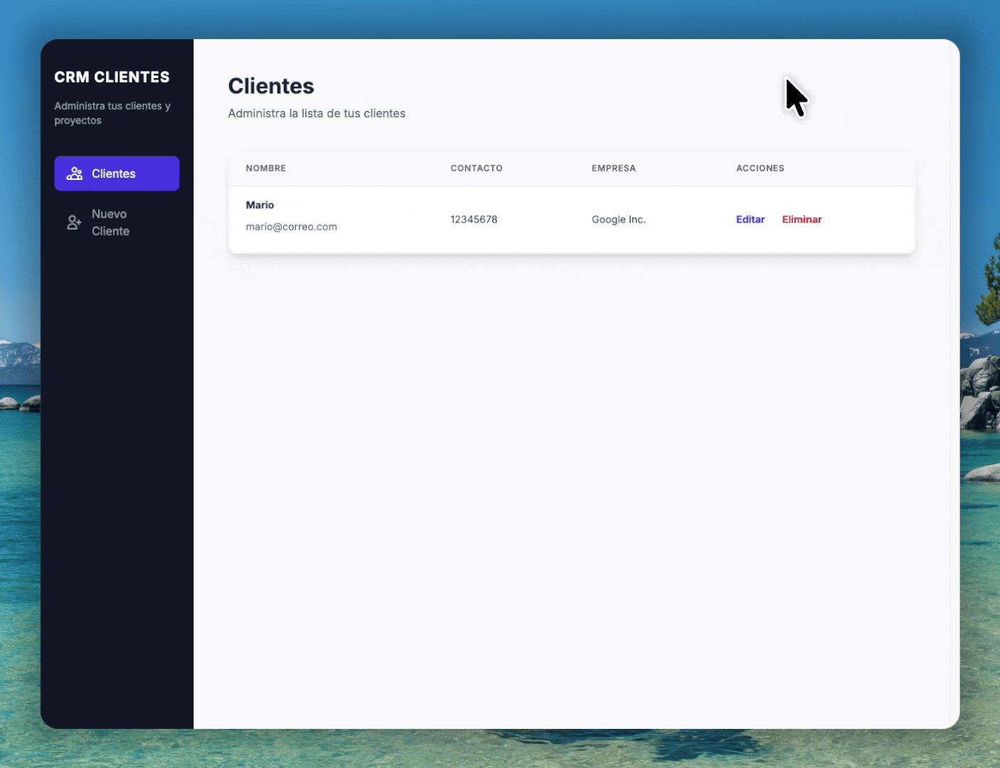

# CRM - Administrador de Clientes

Este es un sistema de gestión de clientes (CRM) desarrollado en JavaScript que permite administrar una base de datos de clientes de manera sencilla. Utiliza `json-server` para simular una API REST, permitiendo realizar operaciones CRUD (Crear, Leer, Actualizar y Eliminar) completas.

## Demo



## Características

- **Gestión de Clientes (CRUD)**:
  - **Crear**: Agregar nuevos clientes con validación de formularios.
  - **Leer**: Visualizar un listado de todos los clientes registrados.
  - **Actualizar**: Editar la información de los clientes existentes.
  - **Eliminar**: Borrar registros de clientes de la base de datos.
- **Interfaz Moderna**: Diseño limpio y responsivo utilizando **Tailwind CSS**.
- **Persistencia de Datos**: Simulación de backend real utilizando **JSON Server**.
- **Validaciones**: Comprobación de campos obligatorios antes de enviar datos.
- **Notificaciones**: Alertas visuales para feedback del usuario (errores, confirmaciones).

## Tecnologías utilizadas

- **HTML5**: Estructura de la aplicación.
- **Tailwind CSS**: Framework de estilos para un diseño rápido y responsivo.
- **JavaScript (ES6+)**: Lógica del cliente, Módulos, Async/Await y Fetch API.
- **JSON Server**: Herramienta para simular una API REST completa con un archivo JSON.

## Instalación y requisitos

Para ejecutar este proyecto localmente, necesitas tener **Node.js** instalado.

1.  **Clonar el repositorio**

    ```bash
    git clone https://github.com/mariokarajallo/crm-jsonserver-javascript.git
    cd crm-jsonserver-javascript
    ```

2.  **Instalar JSON Server (Globalmente)**

    Si no tienes instalado `json-server`, instálalo globalmente:

    ```bash
    npm install -g json-server
    ```

3.  **Iniciar el Servidor**

    El proyecto está configurado para conectarse al puerto **4000**. Ejecuta el siguiente comando para iniciar la base de datos simulada:

    ```bash
    json-server --watch db.json --port 4000
    ```

4.  **Ejecutar la App**

    Abre el archivo `index.html` en tu navegador web. Si usas VS Code, puedes usar "Live Server".

## Cómo funciona

1.  **Dashboard (Inicio)**: Al abrir la aplicación, se realiza una petición `GET` a la API para obtener y listar todos los clientes en la tabla principal.
2.  **Agregar Cliente**:
    - Navega a "Nuevo Cliente".
    - Llena el formulario.
    - Al enviar, se hace una petición `POST` para guardar el cliente en `db.json`.
3.  **Editar Cliente**:
    - Haz clic en el botón "Editar" de un cliente.
    - Se cargan los datos actuales (petición `GET /:id`).
    - Modifica los campos y guarda los cambios (petición `PUT /:id`).
4.  **Eliminar Cliente**:
    - Haz clic en "Eliminar".
    - Se solicita confirmación y se envía una petición `DELETE /:id`.

### Validaciones

El sistema incluye validaciones en los formularios para asegurar la integridad de los datos:

- **Campos vacíos**: No se permite crear ni editar clientes si algún campo (Nombre, Email, Teléfono, Empresa) está vacío.
- **Alertas**: Se muestra un mensaje de error en pantalla si la validación falla.

## Estructura de archivos

```bash
crm-jsonserver-javascript/
├── css/
│   └── tailwind.min.css    # Hoja de estilos (aunque el proyecto usa CDN)
├── js/
│   ├── API.js              # Interacción con la API (Fetch: GET, POST, PUT, DELETE)
│   ├── app.js              # Lógica del Dashboard y listado de clientes
│   ├── editarcliente.js    # Lógica para editar clientes existentes
│   ├── funciones.js        # Funciones reutilizables (validación, alertas)
│   └── nuevocliente.js     # Lógica para agregar nuevos clientes
├── db.json                 # Base de datos simulada (JSON)
├── editar-cliente.html     # Vista de formulario para editar
├── index.html              # Vista principal (Dashboard)
├── nuevo-cliente.html      # Vista de formulario para crear
├── crm-jsonserver-javascript.gif # Demo del proyecto
├── LICENSE                 # Archivo de licencia
└── README.md               # Documentación
```

## Contribuciones

¡Las contribuciones son bienvenidas! Si deseas mejorar este proyecto, por favor sigue estos pasos:

### Pasos a seguir

1.  Haz un **Fork** del repositorio.
2.  Crea una nueva rama para tu funcionalidad (`git checkout -b feature/nueva-funcionalidad`).
3.  Realiza tus cambios y haz **Commit** (`git commit -m 'Agregar nueva funcionalidad'`).
4.  Haz **Push** a la rama (`git push origin feature/nueva-funcionalidad`).
5.  Abre un **Pull Request**.

### Sugerencias

- **Buscador**: Implementar una barra de búsqueda para filtrar clientes por nombre o empresa.
- **Paginación**: Añadir paginación al listado si la base de datos crece mucho.
- **Validación de Email**: Mejorar la validación para asegurar el formato correcto del correo electrónico.

## Créditos

- **Juan Pablo De la Torre Valdez** - Instructor y autor del contenido del curso - [Codigo Con Juan](https://codigoconjuan.com/).
- **Mario Karajallo** - Implementación del proyecto y mantenimiento - [Mario Karajallo](https://karajallo.com).

## Licencia

Este proyecto está bajo la licencia MIT. Véase `LICENSE` para más detalles.

---

⌨️ con ❤️ por [Mario Karajallo](https://karajallo.com)
